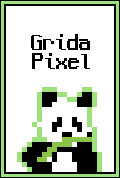
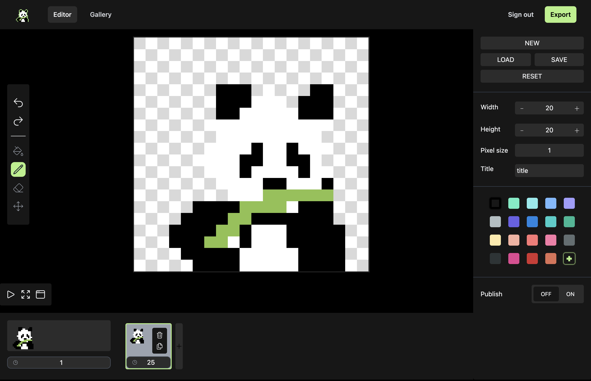

# Grida Pixel


<br>
[Grida Pixel](https://gridapixel.site/)은 움직이는 pixel art를 만드는 애플리케이션입니다.

<p align="center">
  <br />
  <a href="https://gridapixel.site/">Grida Pixel</a>
  ·
  <a href="https://github.com/LemonScone/pixel-art/wiki">Wiki</a>
  ·
  <a href="https://github.com/LemonScone/pixel-art/issues"> Request Feature</a>
</p>

<a target='_blank' href='https://github.com/LemonScone' title='Lemon Scone'></a>
<a href="https://github.com/LemonScone/pixel-art/actions"></a>

</p>

## Acknowledgments

**Grida Pixel**은 [jvalen의 Pixel Art to CSS](https://github.com/jvalen/pixel-art-react)에서 영감을 얻었습니다.

### 무엇이 다른가요?

**기존 프로젝트와 차이점**

- 회원가입/로그인 기능이 있어 `localStorage`가 아닌 Database에서 유효한 데이터를 저장하고 불러올 수 있습니다.
- pixel art를 `.svg`로 export할 수 있습니다.
- pixel art를 `.gif`로 export시 배경을 투명하게 처리할 수 있습니다.
- 연필, 지우개 도구의 크기를 변경할 수 있습니다.
- palette 색상을 무제한으로 추가할 수 있습니다.
- 작업물을 공유할 수 있습니다.

[✏️ 사용해보기](https://gridapixel.site/)

<p align="center">
  
</p>

## Built With

이 애플리케이션은 다음 기술들로 만들어졌습니다:

- [](https://www.typescriptlang.org/) 타입 관련 버그를 방지하며 코드 자동 완성, 오류 피드백 등 IDE의 지원을 받습니다.
- [](https://www.typescriptlang.org/) UI를 만들기 위한 라이브러리
- [](https://reactrouter.com/en/main) URL에 따라 여러 페이지를 동적 라우팅합니다.
- [](https://redux.js.org/) 상태 관리 라이브러리로 Flux 아키텍처를 구현합니다.
  - [Redux Toolkit](https://redux-toolkit.js.org/) Redux 공식 문서에서 권장하는 방식으로 코드를 작성할 수 있는 도구입니다. Redux 사용시 기본 설정, 구조를 간소화하고 내부적으로 [immer](https://immerjs.github.io/immer/) 라이브러리를 사용해 불변성을 유지하며 상태를 변경할 수 있도록 합니다.
  - [Redux Toolkit Query](https://redux-toolkit.js.org/rtk-query/overview) API 호출과 데이터 캐싱을 간단하게 처리할 수 있으며 Redux 스토어와 통합할 수 있습니다.
- [](https://tailwindcss.com/) 미리 정의된 명확한 이름의 클래스를 사용해 스타일링을 빠르고 쉽게 작성할 수 있습니다.
- [](https://nestjs.com/) RESTful API 작성 및 인증/권한을 구현했습니다.
- [](https://www.mysql.com/) 작업한 pixel art를 Database에 저장하고 불러옵니다.
- [](https://swagger.io/) API 문서화 및 API 테스트를 쉽게 하기 위해 적용했습니다.
- [](https://vitejs.dev/) Frontend 빌드 도구, 빠른 개발 환경을 제공합니다.
- [](https://vitest.dev/) React Component 및 unit 테스팅
  - [Mock Service Worker](https://mswjs.io/) Frontend에서 API를 mocking 합니다.
- [](https://jestjs.io/) NestJS 모듈 테스트
- [](https://github.com/features/actions) 배포 자동화
- [](https://www.nginx.com/) 정적 파일을 서빙하고 가상 호스팅을 통해 도메인에 대한 요청을 Backend 서버로 연결합니다.
- [🐶 husky](https://github.com/typicode/husky), [lint-staged](https://github.com/okonet/lint-staged) 테스트 및 lint 자동화

## Getting Started

### Installation

repository를 clone 합니다.

```bash
git clone https://github.com/LemonScone/pixel-art.git
```

```bash
# backend
cd backend
npm install

# frontend
cd frontend
npm install
```

### Development

#### 환경 변수 설정

```bash
cd backend/src/envs
touch development.env
```

```
DATABASE_HOST=
DATABASE_PORT=
DATABASE_USER=
DATABASE_PASSWORD=
DATABASE_NAME=
JWT_SECRET=
JWT_EXPIRATION_TIME=
JWT_REFRESH_SECRET=
JWT_REFRESH_EXPIRATION_TIME=
```

#### 개발 서버 실행

```bash
# backend
cd backend
npm run start:dev

# frontend
cd frontend
npm run dev
```

### Deploy

#### 환경 변수 설정

```bash
cd backend/src/envs
touch production.env
```

```
DATABASE_HOST=
DATABASE_PORT=
DATABASE_USER=
DATABASE_PASSWORD=
DATABASE_NAME=
JWT_SECRET=
JWT_EXPIRATION_TIME=
JWT_REFRESH_SECRET=
JWT_REFRESH_EXPIRATION_TIME=
SSL_PRIVATE_KEY_PATH=
SSL_CERT_KEY_PATH=
```

빌드 후 서버를 실행합니다.

```bash
# frontend
cd frontend
npm run build

# backend
npm run build
npm run start
```

## Lint

프로젝트에서 코드베이스를 건강하게 유지하는 데 도움이 되는 몇 가지 라이브러리가 있습니다:

- [ESlint](https://eslint.org/)
- [Prettier](https://prettier.io/)
- [husky](https://stylelint.io/)
- [lint-staged](https://github.com/okonet/lint-staged)

커밋할 때마다 `prettier`, `eslint`를 실행하고 TypeScript 코드를 컴파일합니다. 스테이징된 파일과 관련된 테스트 코드도 실행됩니다.

`package.json`의 아래 코드를 참고합니다.

```json
"lint-staged": {
  "*.{ts,tsx}": [
    "prettier --write",
    "eslint --fix",
    "tsc-files --noEmit src/desc.d.ts",
    "vitest related --run"
  ]
},
```

## Testing

Frontend 테스팅을 위해 [Vitest](https://vitest.dev/) framework를, Backend 테스팅은 [Jest](https://jestjs.io/)를 사용합니다.

```bash
# backend
cd backend
npm run test

# frontend
cd frontend
npm run test
```

## License

[MIT](https://opensource.org/licenses/mit-license.php) License에 따라 배포됩니다. 자세한 내용은 `LICENSE`를 참조하세요.
